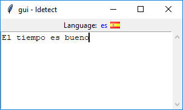

# ldetect
[](https://opensource.org/licenses/MIT)  
A basic language detector based on word dictionaries and letter frequency analysis

## Features
- [x] Detect by dictionnaries (based on @Alir3z4 [stop-words](https://github.com/Alir3z4/stop-words))
- [ ] Detect by letter frequencies
- [x] gui tkinter

## Code sample
> The quality of detection depends on the dictionary quality or the text length

```py
from languagedetector import LanguageDetector

ld = LanguageDetector()

ld.addDict('fr', 'dict/dico_fr.txt')
ld.addDict('en', 'dict/dico_en.txt')
ld.addDict('es', 'dict/dico_es.txt')
ld.addDict('it', 'dict/dico_it.txt')
ld.addDict('ru', 'dict/dico_ru.txt')

ld.detect('Il fait beau') # 'fr'
ld.detect('The weather is fine') # 'en'
ld.detect('El tiempo es bueno') # 'es'
ld.detect('Il tempo è bello') # 'it'
ld.detect('Это приятно') # 'ru'
```
 ### gui

 